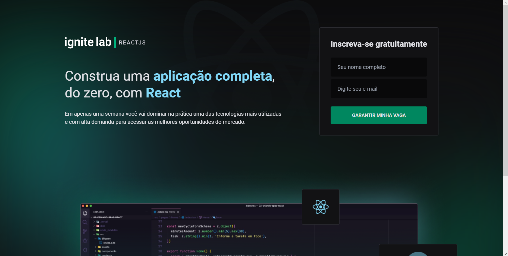

# IgniteLab

---

## Evento

### Descrição

 

O IgniteLab é um evento promovido pela [RocketSeat](https://www.rocketseat.com.br) com o intuito de promover seu curso profissionalizante o Ignite, que conta com diversas trilhas focadas no desenvolvimento web.




## Objetivo

O objetivo proposto para esse evento é construir uma plataforma que disponibiliza vídeos de acordo com suas respectivas datas de lançamento, todas as informações dos conteúdos são gerenciadas a partir do GraphCMS. Os vídeo disponibilizados da plataforma são referentes ao primeiro reality show no universo da programação: [Show me the Code](https://www.youtube.com/watch?v=i9rNFEaRE9s&list=PL85ITvJ7FLoglgoqriHWXK9yE_N0qf4tO), cujo criador é a própria RocketSeat.

## Projeto

O projeto do Frontend foi criado utilizando [React](https://pt-br.reactjs.org) com [TypeScript](https://www.typescriptlang.org) a partir do [Vite](http://vitejs.dev) e faz uso de varias bibliotecas listadas a seguir:

1. [Tailwindcss](https://tailwindcss.com)- CSS declarativo com premissa de Mobile First (Responsividade).
2. [Headlessui](https://headlessui.dev) - Acessibilidade.
3. [GraphCMS](https://hygraph.com/pricing) - Gerenciador de conteudos GraphQL
4. [Phosphor Icons](https://phosphoricons.com) - Icones com integração direta com React.
5. [React Router](https://reactrouter.com) - Rotas do client-side.
6. [Apollo](https://www.apollographql.com) - Requisição GraphQl.
7. [VimeJs](https://vimejs.com) - Player de vídeo.
8. [GraphQl Code Generator](https://www.graphql-code-generator.com) - Gerador de Schema, Queries e Mutations GraphQl
9. [Date Fns](https://date-fns.org) - Comparador de datas
10. [Class Names](https://github.com/JedWatson/classnames) - CSS condicional

Todo projeto seguiu fielmente o layout do Figma : 

[https://www.figma.com/file/iBMK7FCdjJrnndyWyP38Mw/Plataforma-de-evento---Ignite-Lab-(Community)?node-id=0%3A1](https://www.figma.com/file/iBMK7FCdjJrnndyWyP38Mw/Plataforma-de-evento---Ignite-Lab-(Community)?node-id=0%3A1)

### Uso

Clonar o repositório utilizando o `git clone` ou baixa-lo compactado como .`zip`.

Abrir o a pasta do repositório e instalar as dependências do `package.json` utilizando o `npm install`

Crie uma conta no [GraphCMS](https://hygraph.com/pricing) e clone o projeto: 

[https://app.hygraph.com/clone/4d774ce6e96448759d428e87cdfe8647?name=Ignite Lab - Lucas Brito](https://app.hygraph.com/clone/4d774ce6e96448759d428e87cdfe8647?name=Ignite%20Lab%20-%20Lucas%20Brito) o projeto  vai trazer todos os `assets` adicionados, mas todo conteúdo pode ser alterado no menu `Content` o  painel do GraphCMS

Crie um arquivo `.env.local` na raiz do projeto e insira as seguintes variáveis de ambiente:

```jsx
VITE_API_URL= // Content API no Menu API Access
VITE_API_ACESS_TOKEN = // Permanent Auth Tokens no Menu API Access
```

Caso queira mudar ou adicionar Queries ou Mutations: Crie um arquivo `codegen.yml` na raiz do projeto e adicione as seguintes configurações:

```jsx
schema: // URL da Content API no Menu API Access

documents: './src/graphql/**/*.graphql'

generates:
  ./src/graphql/generated.ts:
    plugins:
      - typescript
      - typescript-operations
      - typescript-react-apollo
    config:
      reactApolloVersion: 3
      withHooks: true
      withHOC: false
      withComponent: false

```

Faça as alterações necessárias e execute o script `codegen`  com o comando `npm run codegen`

Iniciar o modo de desenvolvimento utilizando o `npm run dev`

Acessar a URL [`http://localhost:3000`](http://localhost:3000/) para visualizar o projeto.

